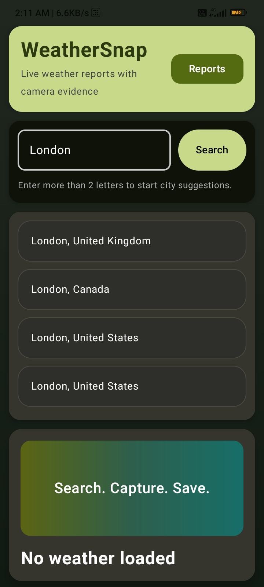
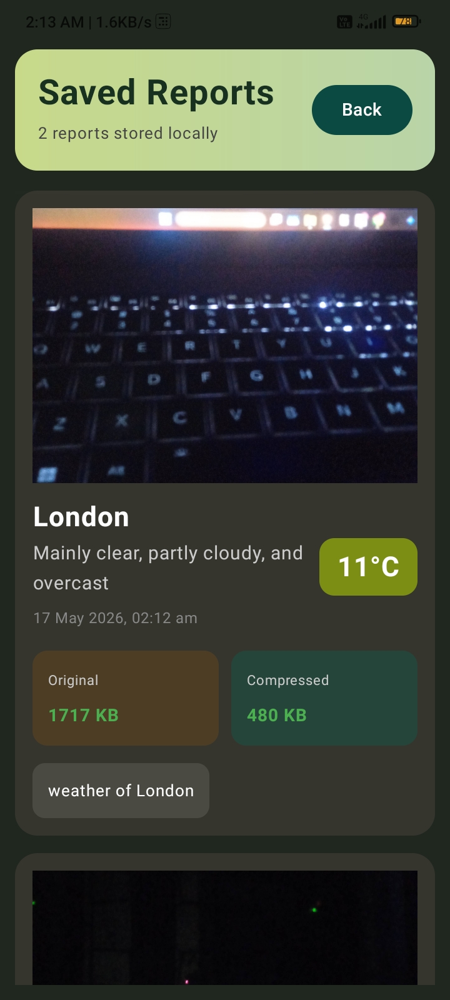
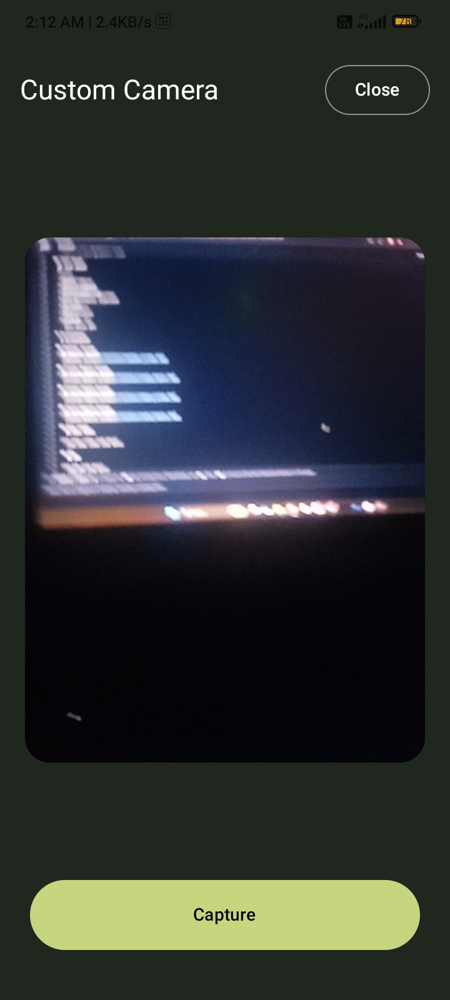
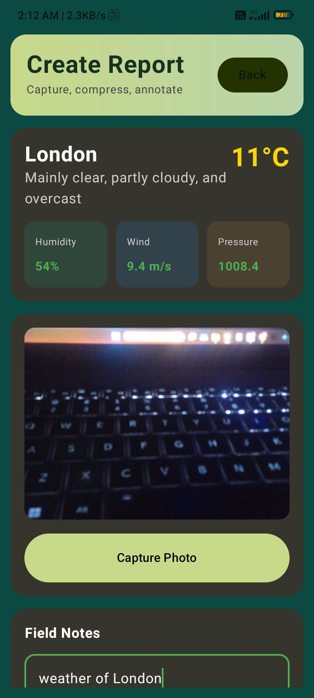

# WeatherSnap

WeatherSnap is a modern Android weather reporting app built using Kotlin and Jetpack Compose.

## Features

- City search with live suggestions
- Real-time weather data
- Camera capture with CameraX
- Weather report creation
- Local report saving using Room Database
- Image compression
- Offline/error handling
- Modern UI with gradient theme

## Tech Stack

- Kotlin
- Jetpack Compose
- MVVM Architecture
- Hilt Dependency Injection
- Retrofit
- Room Database
- CameraX
- Open-Meteo API
# Screenshots

## Weather Screen

## Create Report Screen

## Custom Camera Screen

## Saved Reports Screen

# Demo & APK

[Google Drive Folder](https://drive.google.com/drive/folders/1JJ3XcrGxeAMgJWgL1iTegxZsjC58qPJz?usp=sharing)

